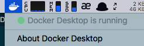

# Instagram Post Scheduler
## 使用步骤
1. 安装 Docker：（以 macOS 为例）
- 打开 Terminal（终端），复制粘帖以下命令到终端后，按回车键：
```shell
brew cask install docker
```

2. 在终端中进入一个合适的文件夹，执行以下命令：
```shell
git clone https://github.com/hunterMG/Ins_scheduler.git
cd Ins_scheduler
```

3. 在 `resource` 文件夹下，新建 `task.txt` 文件，此文件存放将要执行的 Post 计划，格式参考 `task_example.txt`
> 文件中每一行为一个 post 计划。 每一行的内容包括 :  
>> `时间` ：发布该 post 的时间  
>> `标题` ：post 的说明文字， `hashtag` 前加 “#”  
>> `视频文件名` ：包含文件后缀  
> 这 3 部分以英文的分号 “;” 分隔。

4. 将所要发布的视频文件复制到 `resource` 文件夹中。

5. 在 `config.php` 中填写用户名和密码。

6. 运行 Docker， Docker 启动后（如下图），在终端中进入当前文件夹, 运行下方命令:



```shell
docker-compose up
```